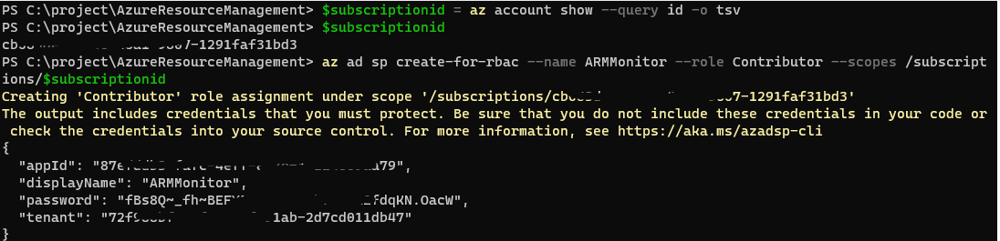

# AzureMonitor

[Metrics](https://learn.microsoft.com/en-us/rest/api/monitor/metrics/list?tabs=HTTP) REST API 를 사용하기 위해 필요한 과정과 예제 코드 입니다.

## Service Principle 생성
azure_auth가 Azure Active Directory OAuth2 Flow 타입인 경우 SP 생성 후 해당 SP의 권한으로 API를 호출해야 합니다.
```powershell
# 구독id 쿼리
$subscriptionid = az account show --query id -o tsv

# 구독id 출력
$subscriptionid

# sp 생성
az ad sp create-for-rbac --name ARMMonitor --role Contributor --scopes /subscriptions/$subscriptionid
```
다음 그림처럼 ARMMonitor 서비스 계정이 만들어지고 Contributor로 지정한 구독에 권한이 부여 됩니다.
> 구독 단위보다는 리소스 그룹단위로 권한을 축소하세요.


Service Principle 이 생성이 되고난 결과 값의 키와 소스코드의 키는 다음과 같이 매핑이 되어야 합니다.

`clientId = appId`

`clientSecret = password`

`tenantId = tenant`

`subscriptionId = $subscriptionid`


## 조회할 리소스 ID 얻기
